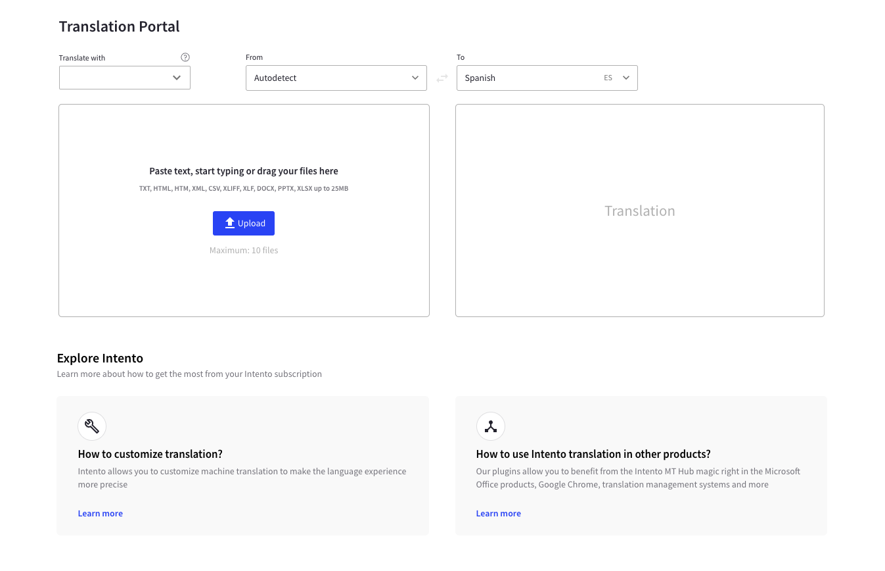
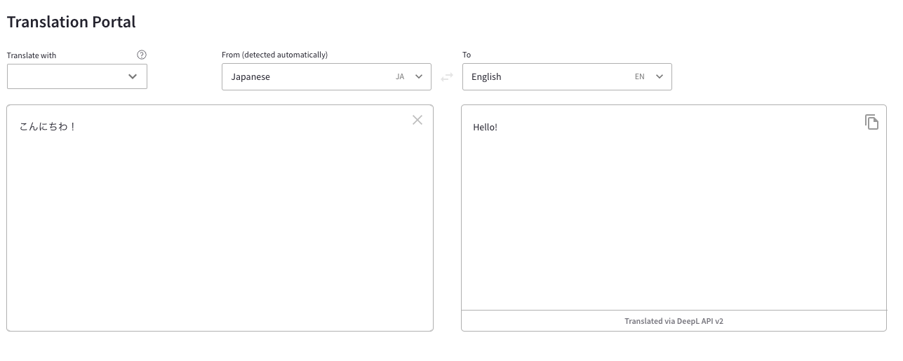
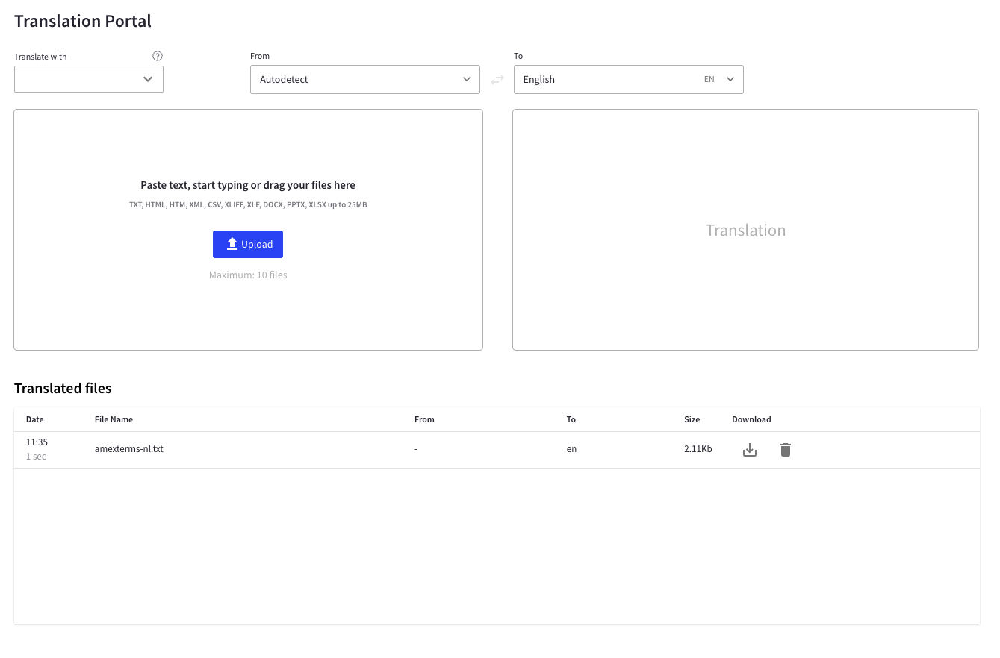

# Translation Portal

The [Translation Portal](https://portal.inten.to/) lets you try different Machine Translation (MT) engines without programming. You can also embed the Translation Portal in internal sites, portals, and more.

## Translating a file

To translate a file do the following:

1. Select a routing mode in the **Translate with** field. [Smart Routing](smart-routing) is enabled by default. The list of available translation engines change depending on the selected language pair. The longer the text or passage that the user is entering, the more accuracy can be gained in language detection
2. Select a language pair to translate with in the **From** and **To** fields.
   - The **From** field defaults to **Autodetect**. **Autodetect** automatically detects the source language you are translating from. The longer the text or passage that is used in the source language, the more accurate the language detection will be.
   - If a language pair is already selected, you can click the **Reverse** button to reverse the **From** and **To** fields to swap the language pair.
3. Enter the source content in the source box. You can start translating with the following:
   - Type your text or paste.
   - Click the **Upload** button to upload your file. Alternatively, you can drag and drop your file in the upload box.
     - Supported formats are TXT, HTML, XML, CSV, DOCX, and XLSX.
     - Maximum upload size is 25000000 bytes or roughly 24 MB (23.8MB) per file, regardless of format.
     - To use PPTX, PDF, and SRT formats, consult our team before use.
4. Click **Translate**. For entered or pasted texts, translation starts at about 2000ms after the last entry.

Empty translation portal. Write, paste text, or upload a file to begin translating.

Translation with entered text.

Previously translated files can be downloaded from the Translated files section.

For more information about subscription plans, users can reach out to [hello@inten.to](mailto:hello@inten.to). For more information about smart routing, see [Intento Smart Routing](smart-routing).
